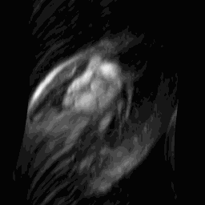
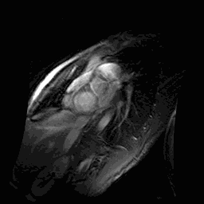
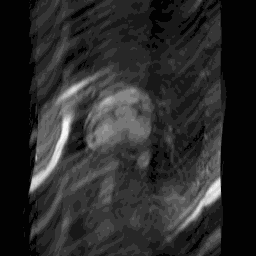
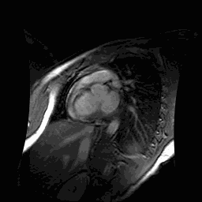
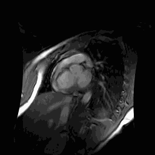

# SEFRN-MRI
This is the official code hub for the SEFRN: Lightweight and Accurate Self-Ensemble Feedback Recurrent Network for MRI Reconstruction (under review)

# Requirements
- Python==3.6.6
- numpy==1.14.3
- opencv-python==3.4.1.15
- scipy==1.1.0
- pytorch == 1.7.0+cu110
- matplotlib==2.2.2
- scikit-image == 0.15.0
- h5py

# How to Train
1. Prepare data.
2. run `run_job.sh`. 

# Prepare Data
1 Cardiac dataset: The original data is established from the work Alexander et al. Details can be found in the paper.  You can download the original data from [Here](http://jtl.lassonde.yorku.ca/software/datasets/).

For us, we use the converted png images provided by [Here](https://github.com/tinyRattar/CDDNwithTDC_storage/tree/master/data/pngFormat), and the convert code is [Here](https://github.com/tinyRattar/CDDNwithTDC_storage/blob/master/data/saveAsPng.m). The data should be placed in `./data/cardiac_ktz/`.

2 Brain dataset: this dataset is establisded by Souza et al. you can download it from [Here](https://sites.google.com/view/calgary-campinas-dataset/download?authuser=0)

3 FastMRI dataset: This is a large-scale MR dataset jointly established by Facebook AI Research and NYU Langone Health. In our work, we use the single-coil Knee MR data for model evaluation. Data can be download from [Here](https://fastmri.med.nyu.edu/)

3 In our training process, we pre-generate a quantity of random sampling masks in the `mask/`, named like `mask_rAMOUT_SAMPLINGRATE.mat`. These masks will be applied in for the Cardiac dataset; For the other datasets, we use the masking function provided by FastMRI.

# Some Visual Result
For the Cardiac dataset, we plot the motion of our predicted image under sampling rate 15%, in order to check whether the predicted motion is normal. Please see the figure below. 

### Example 1 (From left to right: Zero-Filled, Ground Truth and Predicted Image)

  
  
  

### Example 2 (From left to right: Zero-Filled, Ground Truth and Predicted Image)

  
  
  

